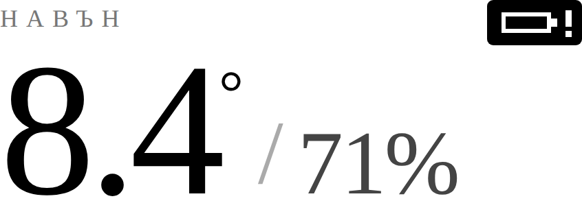

# Kindle dashboard (`GET /kindle`)

A weather panel for a 6" e-ink reader on the local network: outdoor and indoor
temperature from your own sensors, humidity and pressure, a 24-hour trend, and
a short forecast for the part a sensor cannot know.

Point the Kindle's experimental browser at `http://<collector-ip>/kindle`.


Rendered at 600×800 CSS px through a greyscale filter, which is how every
layout decision in this document was checked. It is the current page: a two-column
top block with no masthead — the outdoor headline and its grid on the left, the
clock and the indoor row on the right — three-hourly rules in the chart, the
month above the week strip, and the two manual repaint links in the footer. The page comes to **761 of the 800 px** available.

The figures are synthetic. The **stylesheet is extracted from the `KD_S`/`KD_N`
calls in `KindleDashboard.cpp`** at render time rather than kept as a copy, so
the picture cannot drift from the code on sizes, greys or spacing. The markup
and the strings around it are the preview's own — that half *can* drift, and
once did: a key row in an earlier render described a chart the firmware no
longer drew. Re-render after touching the markup, and read the two side by
side:

```bash
python3 tools/kindle_preview/preview.py hourly bg calm 600
node    tools/kindle_preview/shot.mjs
cp tools/kindle_preview/kindle.png docs/images/kindle-dashboard.png
```

The readings are seeded, so the same arguments give the same picture and a
changed PNG means a changed page. See
[`tools/kindle_preview/`](../tools/kindle_preview/README.md).

## Enabling it

```ini
build_flags =
    ${env.build_flags}
    -DFEATURE_KINDLE_DASHBOARD
    -DKINDLE_OUTDOOR_SENSOR='"outdoor"'
    -DKINDLE_INDOOR_SENSOR='"indoor"'
    ; optional, adds the forecast section
    -DMODULE_FORECAST_ENABLED
    ; see "When the panel repaints" below
    -DKINDLE_REFRESH_SEC=300
    -DKINDLE_REFRESH_MIN_SEC=60
    -DKINDLE_DATA_PERIOD_SEC=60
    -DKINDLE_FOLLOW_DATA=1
```

The two sensor names are instance ids from `platform_config.json`. Typically
`outdoor` is a remote node (see [`node/`](../node/README.md)) and `indoor` is a
locally wired BME280.

### The indoor sensor is usually on the collector, and that biases it

A BME280 bolted to the board running WiFi reads warm — a couple of degrees is
ordinary, more in a closed enclosure. Two consequences, and only one of them is
obvious.

**Temperature** is fixed with a calibration offset, measured against a reference
thermometer after the board has been running an hour:

```json
"calibration": { "temperature": { "offset": -2.5 } }
```

**Humidity is not**, and an offset cannot fix it. Relative humidity is relative
*to* a temperature: the same air reads lower RH the warmer the sensor measuring
it, around 6 % relative per °C. Correcting only the temperature reports a room
drier than it is.

So `BME280Sensor` also publishes **`humidity_amb`** — the RH implied by the
dew point, re-expressed at the true ambient temperature. The dew point is what
makes this work: it is a property of the air's absolute moisture and does not
change because the sensor measuring it is warm. With the temperature offset
above configured, the correction follows from it automatically.

**This page prefers `humidity_amb` and falls back to `humidity`.** A sensor with
no correction configured still shows a figure — and publishes no `humidity_amb`
at all, because there the two would be the same number:
`rhAtTempC(dewPointC(T, RH), T)` recovers `RH` exactly, which
`tests/host/test_psychrometrics.cpp` asserts. The metric appears once an
`ambient_temp_sensor` or a temperature calibration gives it something to do.

> The name is `humidity_amb`, not `humidity_ambient`. `SensorReading::metric`
> is `char[16]` and `make()` copies 15 bytes, so the longer name was stored as
> `humidity_ambien` and never matched a single `strcmp` — in `BME688Sensor`
> from the day it shipped. `tools/check_metric_names.py` now fails the build on
> a name that would truncate.

The best fix is still to get the sensor off the board: 10–15 cm of wire away
from the regulator, and none of the above is needed.

## What is set where

The split is not arbitrary: anything that changes what the page *is* costs
flash whether you use it or not, so it is chosen at build time; anything that
changes what the page *says* is runtime.

| Setting | Where | Why |
|---|---|---|
| dashboard on/off | `setup.h` / `-DFEATURE_KINDLE_DASHBOARD` | the whole renderer is compiled out when off |
| `KINDLE_OUTDOOR_SENSOR`, `KINDLE_INDOOR_SENSOR` | build flag | also names the four `TrendRing` series registered at boot |
| `KINDLE_REFRESH_SEC`, `KINDLE_REFRESH_MIN_SEC`, `KINDLE_DATA_PERIOD_SEC`, `KINDLE_FOLLOW_DATA`, `KINDLE_CLOCK_PIN_REFRESH`, `KINDLE_CLOCK_SYNC_GUARD_SEC` | build flag | they only set numbers in a `<meta>` tag |
| `KINDLE_PAGE_W` | build flag | rescales every size in the stylesheet |
| `KINDLE_LANG_BG` | build flag, and now only a **default** | see [Language](#language) — the setting below overrides it |
| language, face, weight, clock style, time/date/pressure format, which blocks are drawn | **the collector's web UI** | Settings → E-ink dashboard; see [Appearance](#appearance) |
| provider, key, lat/lon, outlook, interval | **the collector's web UI** | Settings → Modules → Weather forecast |

The forecast row is the part you will actually want to change after flashing —
coordinates, and whether the three columns step in hours or days — so it is a
module with a config schema like any other. Nothing about the forecast needs a
reflash.

The sensor ids are compile-time because `kindleTrackTrends()` registers them
with `TrendRing` once in `setup()`, before `ProcessingTask` starts, so that no
reading is missed. Making them editable at runtime means discarding 24 hours of
history on every save, which is a worse trade than editing one line and
reflashing on the rare occasion a sensor is renamed.

## The target

**Kindle Paperwhite 4** — 10th generation, 2018, model **PQ94WIF** — and any
other reader with the same 6" panel: 1072×1448 at 300 ppi.

> An earlier version of this document called PQ94WIF a 7th-generation 2015
> Paperwhite 3. That was wrong; it is the 10th generation. Nothing in the
> layout depended on it — both readers have the same panel — but the browser
> claim below did.

### It also suits a basic Kindle, by coincidence

**Kindle (7th generation, 2014)** — the entry-level model, 6" at **800×600 and
167 ppi**, 16 grey levels, infrared touch, Pearl e-paper, **no front light**.

Its panel *is* 600×800 at `devicePixelRatio` 1, so the default
`KINDLE_PAGE_W=600` maps one CSS pixel to one device pixel with no browser
scaling at all — the hairline softening the width knob exists to avoid does not
arise there.

And the two targets come out the same physical size. A Paperwhite spreads 600
CSS px across 1072 device px at 300 ppi, which is 0.151 mm per CSS px; the
Kindle 7 maps them 1:1 at 167 ppi, which is 0.152 mm. The page occupies the same
area of glass on both.

Two things are worse on it, though: Pearl e-paper ghosts more than Carta, so
`/kindle/clear` earns its keep; and with no front light a shelf dashboard needs
room light to be read at all.

Its firmware also predates 5.16.4, so the browser really is the old WebKit —
there the zero-JavaScript rule below is a requirement rather than a choice.

### Choosing the layout width

```ini
-DKINDLE_PAGE_W=600    ; default
```

Every size on the page is written as the figure it was tuned at for a 600 px
layout and passed through `kdPx()`, which rescales it to `KINDLE_PAGE_W` and
rounds. Proportions are identical at any width; only the pixel grid changes. At
600 `kdPx()` is the identity, so the default build is unchanged.

**Where 600×800 came from:** not a reported viewport. The page pins its own
layout width in the viewport meta, so the browser scales that width across the
panel's 1072 device px and the 1448 px of height follows the same ratio — at
600 that is about 1.79× and roughly **810 CSS px** of height, which is where the
800 px budget comes from.

**Why the width is a knob.** At 600 the browser scales the whole page by 1.79.
Type survives that — it is rasterised at the final size, not upscaled — but a
1 px rule becomes 1.79 device px and lands soft across two rows of pixels.
Laying out at the panel's own pixel count keeps hairlines on the grid.

Whether that helps depends on what the reader's browser reports for its
viewport and `devicePixelRatio`, which no amount of reasoning settles.

### `GET /kindle/probe`

Load it on the reader and read the numbers off:

- `innerWidth`, `innerHeight`, `devicePixelRatio` and `screen` — printed by the
  one piece of JavaScript in this whole feature, because those numbers are only
  knowable from inside the browser;
- the **user agent**, taken from the request header and printed server-side, so
  a firmware that runs no script still tells you which browser it is;
- a **ruler** of fixed-width bars needing no script at all: whichever bar
  reaches the right edge without overflowing names the value to build with.

| Value | Try it when |
|---|---|
| `600` | default; works on any firmware |
| `536` | the probe reports `devicePixelRatio` 2 |
| `1072` | the probe reports 1 |

Below 320 or above 2400 the build fails rather than rendering something that
was never measured. All three values above are checked at the device's viewport
before release: 761 of 810 at 600, 678 of 724 at 536, 1357 of 1448 at 1072, and
no horizontal overflow at any of them.

An earlier attempt at this got the chart wrong — the SVG kept its 600-px size
while everything around it scaled, which at 536 pushed the page 40 px wider than
the screen. That is the failure mode to watch for when adding anything with a
hard pixel size: it looks right at the default and only breaks off it.

### Why it is built for an old browser anyway

The Experimental Browser is WebKit, but *which* WebKit depends on firmware.
Older builds report a user agent in the 531–534 range — 2010–2011 vintage, with
no `fetch`, no `Promise`, no ES6, no flexbox, no CSS grid. Firmware **5.16.4**
modernised it on the 10th and 11th generation, so an up-to-date PQ94WIF would
in fact handle rather more than this page uses.

It is still built for the old one, because doing so costs nothing and the
alternative is a page whose correctness depends on the reader's firmware
version. So the page:

- is rendered server-side and ships **zero JavaScript**;
- lays out with tables and blocks, because those work on both;
- draws the trend chart as **inline SVG path data** — no canvas, no charting
  library, nothing to execute;
- refreshes with `<meta http-equiv="refresh">`, not a script.

None of that is a sacrifice on this medium. A panel that repaints in full or
not at all has no use for a script that updates part of itself.

### It is read from across a room, not held

A Kindle on a shelf is not a Kindle in a lap, and the scale this page started
with was a lap scale: 10 px captions, 12 px section headings, a 14 px line under
the headline. At 167 ppi 10 CSS px is **1.5 mm of em** — about a millimetre of
cap height. At arm's length that is comfortable. From the other side of a room
it is a grey smudge, and the smudge was carrying the units, the axis, the day
names and the age of the forecast: everything that says what the big numbers
mean.

So the scale was **compressed rather than enlarged** — the small end grew by
about a third, the large end did not move at all.

| | was | is |
|---|---|---|
| captions (`.lab`), weekday names, outlook labels | 10–11 px | **14 px** |
| section headings (`.sec`), footer, chart key | 12–13 px | **15 px** |
| chart axis (`.ax`) | 11 px | **14 px** |
| the 24 h line under the headline (`.sub`) | 14 px | **17 px** |
| outlook temperatures, day numbers | 19 / 24 px | **22 / 30 px** |
| grid, indoor and forecast values | 26–31 px | **27–34 px** |
| headline, clock, first indoor value | 88 / 96 / 52 px | unchanged |

**The headline and the clock stayed put for a reason that is not taste.** The
top block is a content-sized two-column table and `.head` is
`white-space:nowrap`, so growing the hero takes width from the right-hand
column — at the widest headline the page draws, `-12.4° / 100%`, the indoor
degree sign fell off the end of its cell. They were also the two things already
legible from the far side of the room.

The height came out of the page's own white space rather than out of the
budget: the body padding, the three section rules, the week strip's cells and
the gaps under the headings each gave back a few pixels. What was left went
into the **chart, 200 → 220 CSS px** — the one block whose job is a shape
rather than a number, and so the one that spends vertical resolution well. The
page finishes at **778 of 800** in the busiest arrangement it draws, where it
finished at 762.

Two sizes were then pulled back a step by measurement rather than taste. At
29 px `1008 hPa` with a tendency arrow after it did not fit a third of the
left column, and `.cv` clips — so the arrow, the one glyph that says which
way the pressure is going, was the part that fell off; three across is 27.
And the daily outlook shows a *pair* of temperatures in an 88 px plate, where
23 px put the widest one the forecast can produce at 86 of those 88 with no
clip to catch it; the plates are 22.

### On the panel the same change buys much more

The panel had room the page never did. Its tiling is absolute coordinates
instead of a flow layout, and it stopped at **701 of 800** — 99 px of blank
screen under the footer, with every size on it chosen to fit above that line.
Both layout files were re-tiled from the top down to spend it; the footer now
finishes at 788.

Nothing had been checking that tiling. Fifty-five coordinates moved, and a
panel is the one renderer nobody can watch — a section drawn over its neighbour
comes back as a photograph, days later. So `tests/kindle/drive_dash.sh` now
asserts the whole chain on **both** panels, from the layout files themselves and
through the same `text_geom()` the renderer positions with: each section clears
the next, nothing runs past the bottom edge, and the footer has to come within a
twentieth of it. That last clause is the one that keeps the type large — a
layout stopping short of the edge has room it is not spending, and the suite
fails until it spends it.

## The top of the page

There is no masthead. The place name never changed and the date is carried by
the week strip at the foot, so the row was two lines of furniture standing above
the only two numbers the page exists to show. The top block is the masthead.

It is **two columns**. The outdoor readings on the left, the clock and the
indoor row on the right, with a hairline between them.

### Eleven named places

The page began as six hardwired readings, which is a fine dashboard for exactly
one hardware configuration — and this firmware has twenty sensor plugins between
them producing twenty-nine distinct metrics. The cost was not only the metrics
it could not show; it was the ones it insisted on, so a BMP280 outdoors rendered
a humidity dash forever in a space nothing could use.

The fix went too far the other way for a while. The page became a free list of
readings that packed themselves into rows, which could show anything and
therefore had no shape: a different page every time a sensor went quiet.

So the layout is fixed and the CONTENT of each place is the reader's. There are
eleven, always in the same spot at the same size:

```
┌────────────────────────────────┬──────────────────────────────┐
│ «outdoor heading»              │            17:40             │
│                                │ ──────────────────────────── │
│   HERO / BIG                   │ «indoor heading»             │
│   24 h low-to-high · age       │           IN2      IN3       │
│                                │  IN1      44%       42       │
│                                │                              │
│   G1     G2     G3             │                              │
│   G4     G5     G6             │                              │
└────────────────────────────────┴──────────────────────────────┘
```

Each place names a sensor, a metric, an optional caption, how many decimals,
four switches — bold, show the unit, show the age when stale, show the pressure
tendency — and **how dark it is drawn**: black, dark, mid or light grey. Four
levels rather than a colour picker, because the panel has sixteen real grey
levels and the ones worth having are the ones far enough apart to render solid,
which is what the page's palette already is. Set under Settings → E-ink dashboard; stored in
`/config/kindle_slots.json`, not in `config.bin`, so adding a field costs no
migration. `src/web/KindleSlots.h` is the model and has no Arduino in it, which
is what lets `tests/host/test_kindle_slots.cpp` exercise the defaults, the
captions and the closing-up on the build host.

**An empty place is skipped and the ones after it close up.** That is the BMP280
case and the reason any of this exists: no humidity reading, no humidity in the
grid, no hole where one used to be. It is also how "three indoor fields, or two"
is a setting rather than a mode — leave IN3 unconfigured and the other two
spread.

### HERO and BIG share a line

`8.4° / 71%`, on one baseline, the second at half the size, under a single
heading. They are usually one measurement of one parcel of air at one instant,
and a line break between them puts a paragraph boundary through a single
reading.

The line under them is the **24-hour low-to-high of the hero's own metric**,
plus how old the reading is: `-2.4 до 15.3° · 3 мин`. It is composed on the
collector, by `kdSubLine()`, so the wording, the unit and the rounding are the
page's and not each renderer's, and it is set in the page's mid grey rather than
its dark one — it is context for the number above it, not a reading in its own
right. Switch it off under *What is drawn → 24-hour range*.

The pair is the one thing on the page that must not reflow, so it is `nowrap`
with the overflow hidden, and the sizes were measured against the widest it
gets: `-12.4° / 100%`.

### The grid and the indoor row

The same shape at two sizes: **caption above, value under it**. A caption on the
value's own line would be denser, and it also makes every cell a different
width — six captions of different lengths put six numbers at six different x.
Above the value they all start at the cell's left edge.

**Every row divides its own width by its own count.** The grid is up to three
across and two deep, and the cells that survived are spread across balanced,
full rows — 1, 2, 3, then 2+2, 3+2, 3+3. Two readings are two halves, not two of
three thirds with the last one white; four are two rows of two, not three and a
lone cell. Three across is narrower than two, so a row of three steps its type
down: "1008 hPa" with a tendency arrow after it does not fit a third of half a
page at the two-across size.

The indoor row gives its **first field more of the width** (42 % of three, 58 %
of two) because it is set much larger, and that field carries **no caption** at
all — the heading directly above already names the room, and a "TEMP" under it
says nothing the degree sign has not. The line it gives back is spent on type.
The other two hang their captions in the space it does not use and sit on its
bottom edge, so all three values line up along one edge rather than along their
tops.

### Units are footnotes

Degrees and per-cent set tight against the number, everything else after a
space: `8.4°`, `71%`, `1008 hPa`. The unit is drawn at four tenths of its
number's size, and the degree rides at the cap line rather than on the baseline,
where at that size it reads as a lower-case o.

The shell renderer draws each of those as a separate FBInk call, because FBInk
draws one size per call — so the x of each piece depends on the width of the one
before it, and FBInk will not say what that width was. `kdAdvanceMille()` on the
collector measures them and sends the widths in thousandths of the type size;
`${#var}` in the shell would have been wrong twice over, since it counts bytes
("ВЛАГА" is five letters and ten of them) and a digit and a full stop are not
the same width anyway.

### The low-battery badge

A build with `FEATURE_ESPNOW_INGEST` can have battery nodes outside, and a node
whose cells are running down stops reporting without saying anything first. The
page it stops appearing on is the one that ought to warn about it, so when
`espnowAnyBatteryWarn()` is true a badge is drawn at the top right of the
outdoor block, level with its heading:



Three decisions, all of them about the medium:

- **It is drawn, not typed.** Inline SVG rather than `🔋` or `⚠`. The reader's
  font is whatever its firmware ships and Cyrillic coverage already varies
  between them; a warning glyph that renders as a box is worse than no warning,
  because it reads as a rendering fault rather than as a flat battery.
- **It is inverted.** A solid black plate with the battery and the exclamation
  knocked out of it in white. The rest of the page is light, the panel has no
  colour to spend, and on a greyscale screen a small mark is loudest when it is
  cut out of a dark field.
- **It floats.** `.bw` is `float:right`, not flex — the same reason the whole
  page lays out in tables. It also means the badge costs no height: the page
  measures 761 px of the 800 budget with it and without it.

Its geometry goes through `kdPx()` like everything else, so it scales with
`KINDLE_PAGE_W` down to a Kindle 4's 536 px. The condition is
`batteryWarningActive()`, which asks the ingest layer the same question the web
interface asks — one rule for "low", not two that can disagree.

A build without the radio compiles the badge out entirely; there is nothing on
that firmware that could be low.

### Language

**Settings → E-ink dashboard → Language.** It covers the browser page and the
FBInk panel together, because they are one design rendered twice and nobody
reads one in English and the other in Bulgarian. No reflash.

```ini
-DKINDLE_LANG_BG    ; what that setting DEFAULTS to; omit for English
```

It used to be the build flag alone, on the argument that a single-language
build pays nothing for the other and nobody needs to change the language
without a reflash. The second half of that was wrong: the device is a panel on
a wall, its reader is not the person who built the firmware, and "reflash to
read it in your own language" is not an answer. Both wordings are compiled in
now — about a kilobyte of flash across the whole page, and nothing of RAM.

`KLANG_AUTO` is **zero**, which is what an older config's reserved byte reads
as, so a device that upgrades into this keeps saying whatever its firmware was
built to say until somebody chooses otherwise. An unrecognised byte resolves
the same way: a value out of storage is not a promise.

Three things follow from the language being a setting rather than a constant,
and each was somewhere the old design could quietly stay in the old language:

- **`KD_T()` is a call, not a macro that picks a literal.** It can no longer be
  pasted between string literals — `"a" KD_T("b","c") "d"` was compile-time
  concatenation and is now a syntax error, which is a good way for this to fail
  rather than a bad one.
- **The metric label table carries both languages per row** (`labelEn`,
  `labelBg`) and asks when it is read. A table initialised once cannot hold a
  setting.
- **The forecast stores the weekday as a number, not a name.** It is fetched
  every few hours and read every few minutes, so a name written down at fetch
  time is a name in whichever language was set then — switching to Bulgarian
  would have left three English weekdays under a Bulgarian page for up to six
  hours.

What it does *not* translate: the names you have given your places (your text,
drawn as you typed it) and the weather provider's own summary.

The weekday names come from tables in `DashboardStrings.h` rather than from
`strftime`: the C locale would give English names whatever the setting, and
newlib on this part has no `bg_BG` to switch to.

Cyrillic depends on the reader's fallback font. The page declares UTF-8 and
names the device's serif faces first, but Bookerly's Cyrillic coverage varies
by firmware — if Bulgarian shows boxes, that is the font, not the encoding.

**On the panel, the language needs nothing at all.** Every string the FBInk
renderer draws arrives in `/kindle/data`, so it follows the collector's setting
on the next fetch. The single exception is the "cannot reach the collector"
message, which is drawn precisely when the collector cannot be asked: it uses
the wording the last successful fetch left behind, and falls back to English
before first contact — on a panel where nobody has set a language yet.

### The greys

The palette is `#000 #444 #777 #aaa #d8d8d8 #fff` plus two panel washes.

An earlier version of this page was pure black and white, on the reasoning
that "16-level e-ink dithers mid-greys into visible noise". That was
over-cautious and made the page poorer. The panel has **16 real grey levels**;
the dithering worth avoiding comes from gradients and from tones too close
together, not from flat, well-separated fills. Spaced this far apart, each
tone lands on its own level and renders solid.

The min/max band was originally hatched for the same wrong reason. With a flat
wash doing the job, the hatch was texture over texture — two bands that nearly
touch read as one muddy mass — so it is gone.

The two chart lines are still told apart by **dash pattern as well as** shade,
because redundant coding costs nothing and survives a panel with its contrast
turned down.

## Appearance

Everything above describes the page as it is drawn out of the box. Some of it
can be changed afterwards, from **Settings → E-ink dashboard** in the
collector's web interface — the page itself has no settings and never will,
because it is served to a browser with no JavaScript and sometimes no touch
panel, and a form there would be a worse version of the one that already
exists.

| | |
|---|---|
| **Face** | Bookerly (default), Caecilia, Palatino, Baskerville, Helvetica, Futura, or a font-family list of your own |
| **Weight** | which figures are set bold — the headline, the value beside it, the grid, the clock, the indoor row, the units, the forecast, the week strip and the captions; none by default |
| **Clock** | plain, boxed, ruled, or with the date beneath |
| **Time** | `09:05`, `9:05`, `9:05am` |
| **Date** | `27 august`, `august 27`, `27.08.2026`, `2026-08-27` |
| **Pressure** | hPa, mmHg or inHg — the three-hour change follows it |
| **Temperature** | one decimal or whole degrees |
| **Readings** | what goes in each of the eleven places, and each one's caption, decimals, switches and grey level |
| **Blocks** | the value beside the headline, the two-by-two grid, the pressure tendency, the 24 h range, the indoor block, the chart, the week strip, the battery badge |

The settings live in `config.kindle` (`src/core/Config.h`) and are read on
every render, so a save takes effect on the panel's next repaint. They survive
a reflash the way the rest of the configuration does, and they travel through
settings export and import.

### What is not settable, and why

Sizes, spacing, the greys, and the page width. The first three are what make
the page legible from across a room and were arrived at by measuring in a
browser rather than by taste; offering them would mostly offer a way to break
the page. The width stays `KINDLE_PAGE_W` because every size in the stylesheet
is derived from it at compile time.

### How it is emitted

The stylesheet in `KindleDashboard.cpp` is a flat, unconditional run of
`KD_S` / `KD_N` calls and stays that way; anything chosen is appended **after**
it as overrides, by `kdSkinCss()` in `src/web/KindleSkin.h`. Two reasons, and
the first is not cosmetic:

1. `tools/kindle_preview/preview.py` reconstructs the sheet by reading those
   calls out of the source. A branch in it would put every arm of every choice
   into the extracted CSS at once, and the preview would quietly stop being a
   picture of the page.
2. Reading the sheet against the design means reading it top to bottom.

A device on defaults emits an empty override block, which is also why the
defaults are the design rather than something more opinionated: nobody's page
changes appearance because the firmware learned it could.

### The clock styles keep the same height

Each of the four fits in the **100 px** the plain clock's line height sets for
that block, which is where the hairline under it falls and therefore where the
indoor row starts. Boxed takes its breathing room out of its own height, ruled
puts its border inside its padding, and the dated style takes 24 px from the
clock rather than adding them beneath it.

The figure used to be 139, from the layout where the clock sat BESIDE the indoor
block rather than above it and its height set where a divider fell. At 139 the
three non-plain styles came out over the 800 budget —
all three over, and none by enough to be obvious. The page now measures
**757–762 of the 800 in all four**, measured in a browser through `preview.py`,
which extracts the override arm from `KindleSkin.h` the same way it extracts the
base sheet.

### On the faces

Which of them a reader can actually reach depends on its firmware; every stack
ends in a generic family, so a face the device does not carry renders in the
browser's default rather than in nothing. The widest line the page can produce
is `-12° / 100%` in whole-degree mode, and it was checked against both a serif
and a sans fallback in a desktop browser — that is a check of the layout, not
of Bookerly, which is not installable here.

A custom family list is written straight into the page's stylesheet, so it is
filtered on the way in to letters, digits, spaces, commas, quotes and hyphens.

## When the panel repaints

Three ways, and one of them is not what it sounds like.

```ini
-DKINDLE_REFRESH_SEC=300       ; ceiling, and the fixed interval when following is off
-DKINDLE_REFRESH_MIN_SEC=60    ; floor: never repaint more often than this
-DKINDLE_DATA_PERIOD_SEC=60    ; how often readings are expected
-DKINDLE_FOLLOW_DATA=1         ; 0 for the old fixed interval
-DKINDLE_CLOCK_PIN_REFRESH=1   ; 0 lets the clock go stale between reloads
-DKINDLE_CLOCK_SYNC_GUARD_SEC=20 ; never reload sooner than this after rendering
```

### 1. The reader asks

A **refresh** button in the footer. A link, not a script, so a five-way pad
reaches it as readily as a fingertip.

It measures **78×27 CSS px**, which is about **12×4 mm** on any of the readers
this page targets — a 300 ppi Paperwhite scaling 600 CSS px across 1072 device
px and a 167 ppi Kindle 7 mapping them 1:1 both come to 0.15 mm per CSS px.

> An earlier version of this page claimed "128×46 device px, and 44 px is the
> smallest thing worth aiming at". That was wrong twice over: the 44 in the
> usual guidance is CSS px on a phone — roughly **9 mm** — and 4 mm is under
> half of it. The button is reachable with an infrared touch panel but it is not
> generous. Its type grew with the rest of the small end of the scale, which is
> where the height went: the page finishes at 778 of 800 and has none left over
> to make the box itself taller. Taking more would come out of the chart, which
> is a trade worth making deliberately rather than by accident.

> **Route order is load-bearing.** `AsyncCallbackWebHandler::canHandle` matches
> a URL that *starts with* its uri plus `/`, and the first registered handler
> that matches wins. `/kindle` registered before `/kindle/probe` and
> `/kindle/clear` swallowed both, and the sub-pages silently rendered the
> dashboard instead. The children are registered first.

### 2. The reader asks for a clean panel

E-ink keeps a ghost of what it drew before. A page of white and hairlines never
asks the controller for a full waveform, so a heavier layout can sit faintly
underneath for hours. **clear** walks `/kindle/clear` through four full-screen
frames, alternating black and white, and returns to the dashboard. That is what
actually resets the pixels; nothing an ordinary page draws will.

The step number comes in a query string, so it is reader-supplied and clamped —
otherwise a stray link could build a chain that never comes back.

### 3. The page reloads itself — a timer, not a push

**The collector cannot make the reader repaint.** A browser redraws when it
loads a page, and it loads one only when it asks. Server-sent events or a socket
would need JavaScript the older firmware does not have, and holding a request
open on AsyncTCP until data arrives risks the one thing a device on a shelf must
not do.

So `KINDLE_FOLLOW_DATA` **predicts** instead. The page knows when the newest
reading landed and how often readings are expected, and aims its own reload just
after the next one is due:

| Age of the newest reading | Reload in |
|---|---|
| less than one period | just after the next is due (+4 s), clamped to the floor |
| one to two periods | the floor — late, but one missed post is ordinary |
| over two periods | the ceiling — the source looks down, and flashing will not fix it |
| no reading, or clock behind it | the ceiling |

That is the shape of the data path on its own. Read the next section before
relying on it: with the clock on the page it is not the binding constraint at
the default settings, and the panel follows the minute rather than the reading.

### …and the clock, which is usually the louder demand

The clock is rendered server-side. It is correct at the moment it is painted
and stale from then on, so **a clock showing minutes is a standing demand for a
repaint every minute** whatever the data is doing.

`KINDLE_CLOCK_PIN_REFRESH=1` (default) aims the reload at the next **minute
boundary**, and that is not cosmetic. A page that reloads at :58 of each minute
displays the previous minute for 58 seconds out of every 60 — a clock that is
wrong most of the time. Landing on :00 makes the displayed minute change when
the minute changes.

It is deliberately **not** a plain `min()` of the two demands, and getting that
wrong produced two bugs at opposite ends of the same minute:

- at **:58** the boundary is 2 s away, the sync guard pushes the clock's request
  past it, and a data path floored at 60 undercut it by two seconds — locking
  the page permanently to the :58 offset;
- requiring the data to be five seconds earlier fixed that end and broke the
  other: from **:41 to :54** the guard pushes the clock to 79…66 s, the data's
  60 clears the margin, and the alignment is stolen again.

So the test is not *&#34;is the data earlier&#34;* but *&#34;does the data genuinely need a
faster cadence than one repaint a minute&#34;*. Anything asking for 60 s or more
wants what the clock wants, and the clock's version lands on the boundary.

`tests/host/test_refresh_cadence.cpp` checks this exhaustively — from every one
of the 60 seconds in a minute, the next reload lands on a boundary — and runs in
CI under all three sanitiser modes. The second bug above was found by that test,
not by reading the code.

`KINDLE_CLOCK_SYNC_GUARD_SEC` (20 s) is what stops a nearly-arrived boundary
turning into a second flash moments after the page loaded; below it, the
following boundary is taken instead. It is separate from
`KINDLE_REFRESH_MIN_SEC`, which floors the **data** path only — the clock cannot
honour a 60 s floor *and* align from a cold load, so the first reload after a
fresh load may come in 20–79 s before the cadence settles.

**An unsynced device does not pin.** The page prints &#34;clock not set&#34; rather than
a time, so there is no clock to keep honest; pinning there would defeat the
backoff entirely and repaint every minute forever waiting on a node that is not
coming back.

**At the default settings the clock always wins.** The data floor is 60 s and
the clock never asks for more than 60, so `KINDLE_FOLLOW_DATA` changes nothing
unless pinning is off, or `KINDLE_REFRESH_MIN_SEC` drops below a minute with a
node posting faster than that. Said out loud because it would otherwise look
like the data logic is doing work it is not.

### The cost, plainly

Every reload repaints the whole panel: it flashes, and it draws battery. With
the clock pinned that is **about 1440 page loads a day** — a reader on a
charger, not one running a fortnight on its battery.

`KINDLE_CLOCK_PIN_REFRESH=0` lets the clock go stale by up to
`KINDLE_REFRESH_SEC` between reloads. For a 96 px clock read across a room that
is a confident lie, so prefer lowering `KINDLE_REFRESH_SEC` to something the
clock can live with over turning the pinning off.

## The other reader: FBInk, not the browser

Everything above is the page the Kindle's own browser loads. `kindle/` holds
the other reader — a shell script that fetches `/kindle/data`, a plain
`KEY="value"` payload, and draws it straight to the framebuffer with
[FBInk](https://github.com/NiLuJe/FBInk). No browser, no JavaScript, no
document to reflow: it exists because the 7th-generation Kindle's browser is
slow to wake and pushes a full-screen flash every time it repaints.

### Settings live on the device

The collector's address used to be a line in the middle of `update_dash.sh` —
the one setting that changes when a router hands out a new lease, and changing
it needed a text editor, a USB cable and a computer. It is `dash.conf` now,
beside the script, seeded from `dash.conf.default` on first run so that
reinstalling the extension cannot overwrite it.

A Kindle has no keyboard outside its own reader, so `settings.sh` is built
around not needing one:

- **Find collector** takes the Kindle's own IPv4 address, walks the /24 it sits
  on in parallel batches, and keeps the hosts that answer `/kindle/data` with a
  dashboard payload — the body is checked, because anything else on the network
  answering port 80 is not a collector.
- **Next collector** steps to the next address that scan found, wrapping round,
  which is the whole interaction when the first guess was wrong.
- The refresh **profiles** (fast, normal, battery saver) set the five intervals
  together, because "how often should the chart be redrawn" is not a question
  anyone wants to answer five times through a menu that can only step numbers.

Values are validated where they are read, not only where they are written: an
interval of `0` would make the loop divide by it once a minute forever, so a
hand-edited `dash.conf` carrying one falls back to the default and says so.

### The refresh tiers

E-ink ghosts, and the cure — a flashing update, the panel driven to black and
back — is slow and visible. So it is spent where it buys the most:

| Every | Redrawn | Refresh |
|---|---|---|
| `CLOCK_EVERY` (1 min) | the clock | **flashing**, its rectangle only |
| `DATA_EVERY` (5 min) | the readings | plain, its rectangle |
| `GRAPH_EVERY` (15 min) | the chart | plain, its rectangle |
| `FORECAST_EVERY` (30 min) | forecast, week, footer | plain, its rectangle |
| `FULL_EVERY` (60 min) | everything | **flashing**, whole screen |

The clock changes every minute, so it ghosts first — and its rectangle is small
enough that flashing it is barely noticeable, which is why it gets hourly
treatment every minute while the rest of the screen waits.

`FORECAST_EVERY` is a *redraw* cadence and has nothing to do with how often the
forecast is fetched from the API: that is the collector's own interval
(`interval_min`, 10–360, in the Forecast settings). Setting the Kindle's
shorter just redraws the same numbers.

Two mechanics carry more of the result than the intervals do. Each tier
**clears its rectangle before drawing** — e-ink does not erase what it is drawn
over, so `21.0` replaced by `9.8` leaves the `0` standing. And each tier draws
with `fbink -b` (framebuffer only) and **refreshes once at the end**; without
it every string is its own visible repaint, twenty per page, each leaving a
ghost.

### The payload is data, and only some of it

`/kindle/data` arrives over plain HTTP as `KEY="value"` lines, and the reader
parses them rather than sourcing the file — sourcing it was executing the
forecast provider's free-text summary as root. But refusing to *execute* the
file is only half of it: the names it may *assign* have to be bounded too.
`PATH` is a plain variable name; so are `IFS`, `TMP`, `DASH_DIR` and
`SLEEP_PID`. A payload carrying `PATH=/mnt/us/evil` would have the next
`fbink`, `wget` or `date` call run an attacker's binary as root, and
`TMP=/mnt/us` would turn the cleanup handler's `rm -rf "$TMP"` into a wipe of
the user's documents when they pressed Stop.

So the parser takes an allowlist. `dash.conf` passes the exact key names it
owns; the payload passes `PAYLOAD`, which accepts the shapes the collector
actually emits — `Z_*`, `GRID_*`, `IN_ZONES`, `LBL_*`, `FC*`, `WK*`, `OUT_*`,
`IN_*`, `RES_W`, `RES_H`, the chart's axis (`CH_*`) and a handful of named
scalars (`CLOCK`, `CLOCK_ADVW`, `CLOCK_STYLE`, `DATE`, `TIME_FORMAT`,
`SHOW_CHART`, `SHOW_WEEK`, `CHART_OUT`, `CHART_IN`, `KEY_OUT_ADVW`, `LANG`,
`DECIMALS`, `SHOW_FLAGS`) — and drops everything else.

`RES_W` and `RES_H` get a second check, because they are interpolated into a
path that is then executed with `.` to load the layout: digits only, and a
plausible panel size, or the reader falls back to 600x800. Without it,
`RES_W=../../../../mnt/us/x` reached any `.conf`-suffixed file on the device.

### One design, two renderers — and what they were disagreeing about

The panel and the browser page at `/kindle` are the same design drawn twice,
from one set of settings, by two pieces of code that cannot see each other.
Every place they disagree is invisible from both sides: the reader switches
something off, the browser stops drawing it, and the panel on the wall — the
one anybody is actually looking at — carries on. Nothing errors.

Found by holding a photograph of the browser page next to a photograph of the
panel, which is the only instrument this had:

| | The page | The panel, before |
|---|---|---|
| The chart's numbers | five temperatures down the side, five hours along the bottom | **none** — a bare grid, which reads as a sensor that has stopped |
| An empty 24-hour record | a sentence saying it fills as readings arrive | the empty grid again, with no explanation |
| The chart's key | two swatches, at the weights of the lines they name | nothing at all — two lines and no way to tell which was which |
| Every caption | `text-transform:uppercase` | drawn as typed: `Навън`, `Mon`, `август` |
| The week strip | centred in each cell, numerals regular | left-aligned and bold, in all seven |
| The three outlook columns | centred on a `#f0f0f0` plate | left-aligned on white |
| A degree | `.unit-d`, 0.34em | 0.42em, the size of a spelt-out unit |
| The second headline value | `#444` — subordinate to the number it follows | full black, level with it |
| The hairline under the clock | `#d8d8d8` | `#aaa`, the weight of a section rule |
| A place set to "light" ink | `#aaa` | **nothing at all** — `kdInkFbink()` returned `GRAY10`, which is not a colour FBInk has, so the whole draw call failed silently |
| `KSHOW_CHART`, `KSHOW_WEEK`, `KSHOW_BIG`, `KSHOW_BATTERY` | section hidden | section drawn regardless |
| Twelve-hour clock, `9:05` without the leading zero, ISO dates | `kdFmtTime()` / `kdFmtDate()` | always `09:05`, always "27 august" |
| Boxed / ruled / dated clock | four styles in CSS | one, always |
| Hero, clock, forecast, footer, week numerals | 88 / 96 / 28 / 12 / 24 px | 84 / 88 / 26 / 11 / 22 |
| Every string, at the size both files agree on | the em is 88 px | **the em is ~76 px** — `px=88` is a line height to FBInk, not an em |
| Every gap computed from an advance | correct, the browser measures its own | a sixth too wide, so the headline's second value ran into the divider |
| Today, in the week strip | white on black | **a black rectangle with nothing in it**, then a white box with a black date in it — see below: asking FBInk for white on black is what draws the opposite |
| The forecast icon | an SVG chosen by a RANGE of WMO codes | a BMP named after the exact code — and there is no `fc_2` for partly cloudy, so: the question mark |
| The wind line | `вятър 5 km/h · 8 мин` | the wind alone; nothing said how old the forecast was |

### FBInk's `px` is a line height, not an em

The single reason the panel looked worse than the page rather than different
from it. FBInk sizes OpenType text with `stbtt_ScaleForPixelHeight(font, px)`,
and stb_truetype documents that as

    scale = pixels / (ascent - descent)

— its `px` is the whole span from the top of the ascender to the bottom of the
descender. CSS `font-size` is the em square, which for a text serif is some
14–20 % smaller than that span. So `px=88` and `font-size:88px` are **not the
same size**, `tools/check_kindle_parity.py` was right that both files said 88,
and the panel still drew every string about a sixth small: thinner stems, more
air between them, a screen made of correct numbers that looked cheap.

It also moved things. The panel places a value after another by adding
`size × advance-in-mille / 1000`, and the collector measures those advances in
thousandths of the **em** — so while the em was a sixth smaller than the size,
every one of those gaps was a sixth too wide. That is why the headline's
`/ 993 hPa` sat far from the temperature and ran into the divider.

`draw_text()` converts once, at the FBInk call, using `TEXT_PX_MILLE` from the
layout file — `(ascent - descent) / unitsPerEm` in thousandths. Past that
point one design pixel is one em pixel, which fixes the size and the
arithmetic together. The `.conf` keeps the design's number, so the parity
checker still compares like with like; the box is also started half its own
growth higher, so correcting the size does not drop every string down the
screen away from the coordinates it was tuned to.

It is the one number to turn if the type ends up a hair large or small.

Two things that were tuned against the old geometry moved with it, and are
derived now rather than written down: `baseline_mille` — where a baseline
falls below a design `top`, `0.800 × M − (M−1)/2` of the size, 848 at M=1.16
— and the week strip's two rows, which are centred in their cell from the
cell's height and the boxes' real heights. The layout still says how far
apart the two rows sit; where the pair sits is worked out, so it stays
centred whatever `TEXT_PX_MILLE` is. Left as they were, the day number sat
five pixels from the top of its cell and two from the bottom, on the one row
of seven identical boxes where three pixels of list is visible.

### The icon the panel is sent is already reduced

The page picks an SVG by a range — `code >= 61 && code <= 67` is rain. The
panel has eleven BMP files, one per range, named after the range's
representative, and no way in `sh` to reduce a code to its range. So it asked
for the code it was given: Open-Meteo answers **2** for partly cloudy about as
often as 1, there is no `fc_2_52.bmp`, and the fallback is `fc_-1` — the
circled question mark that is supposed to mean "no forecast at all". Three of
them across the outlook row, beside a browser page showing sun and cloud.

`weatherIconCode()` does the reduction, in the collector, and is what
`appendWeatherIcon()` switches on as well — so a range added there reaches both
renderers at once. `/kindle/data` carries `FC_ICON` and `FC0..2_ICON` beside
the raw `FC_CODE`, and the panel does no mapping at all. `check_kindle_parity.py`
holds every value that function can return to a BMP that exists.

### Reading what the panel actually drew

`TRACE=1` in `dash.conf` writes every FBInk call to `kual.log`, beside the
scripts, and draws nothing differently.

THE PANEL IS THE ONE RENDERER NOBODY CAN WATCH. The tests drive it against a
fake FBInk that records its argv; a browser page has a devtools pane; the
thing on the wall has neither. So a report that one cell "does not look right"
arrives as a photograph, and a photograph cannot tell a panel that drew the
wrong thing from one that drew the right thing and had it come out wrong —
which are different bugs with different fixes, in different files. One line
per call is the difference between reading and guessing.

A line per string, so it is off by default.

### White text on a plate is asked for by inverting, not by naming the pens

`-C WHITE -B BLACK` draws the **opposite** of what it says, and this took two
attempts and a photograph to see.

FBInk has a fast path in `print_ot()` for text whose two pens are pure black
and pure white:

    const short int layer_diff = (short int) (fgcolor - bgcolor);
    if (abs(layer_diff) == 0xFFu) {
            uint8_t ainv = 0xFFu;
            if (is_inverted) { ainv = 0U; }
            ...  pixel = lnPtr[k] ^ ainv;

It skips blending and uses stb_truetype's coverage mask directly, XORed with
`0xFF`. That XOR is the assumption that black-and-white text means BLACK ON
WHITE unless `--invert` says otherwise — so the empty ground around the glyphs
became white and the glyphs became black. On the panel: a white box with a
black date in it, in the middle of the black plate meant to contain a white
one. Asking for white on black is precisely the pair that triggers it.

So the two inverted places — today's cell in the week strip, and the boxed
clock — pass `-h`/`--invert` with the pens a NON-inverted call would use.
`--invert` flips the mask and the pens together, so white-on-black comes out
of both of FBInk's paths: the fast one, where the mask is used as-is, and the
general blend, where the pens are swapped before it runs.

It is also right on every Kindle. FBInk's own condition there reads

    (isKindleLegacy && !is_inverted) || (!isKindleLegacy && is_inverted)

— compensating for the legacy models' inverted colour map, so `--invert` means
the same thing to the eye on a K3 as on a KT2, and the panel needs to know
nothing about which it is running on.

`-O`/`--bgless` stays right everywhere else: over a tier's own cleared white
rectangle, it draws the glyphs and no box, so nothing rubs out what came
before it. It does not take the fast path at all.


### Upper case, and why it has to be done at the collector

Every caption on this dashboard is set uppercase, and on the page that is one
line of CSS — which is why the string tables in `DashboardStrings.h` are lower
case and the note over `kdMonth()` says so. The panel has no CSS. It drew
whatever `/kindle/data` handed it, so one dashboard came out `НАВЪН` in the
browser and `Навън` on the panel, most visibly on the two strings a reader
typed themselves.

It cannot be fixed at the reader's end: `tr a-z A-Z` in busybox ash is
ASCII-only, so the panel would keep drawing `Навън` while uppercasing
`Pressure`. `kdUpperUtf8()` does it in the firmware, for ASCII and Cyrillic,
and copies through anything else untouched — a byte it does not understand is a
byte in a label somebody chose. Cyrillic straddles a UTF-8 lead-byte boundary
(а–п is `D0 B0..BF`, р–я is `D1 80..8F`), so the obvious single subtraction
turns "р" into a space and a capital; and a label too long for its buffer is
cut **between** characters, because half a two-byte sequence is not a shorter
word, it is a replacement glyph. `tests/host/test_dashboard_strings.cpp` holds
both.

### The chart's axis

The image is a 4-bit BMP and cannot carry text: drawing any would need a bitmap
font on the ESP32 that this firmware does not have. So the five values and the
five hours travel as strings in `/kindle/data` — with `CH_L`/`CH_R`/`CH_T`/`CH_B`
saying where the plot area sits **inside** the image, taken from
`ChartBmpCtx::init()` rather than re-derived at the other end — and the reader
places them with FBInk. The `lo`/`hi` they are computed from is the image's
own: the same 6 % padding with a 0.4° floor that `appendChart()` and
`ChartBmpCtx::init()` both apply, because a second opinion here would label the
image with somebody else's scale.

### What keeps them together now

`tools/check_kindle_parity.py` reads the stylesheet out of the firmware — the
same extraction `tools/kindle_preview/preview.py` uses, so it cannot hold a
stale copy of the numbers — and asserts that every type size in it appears at
the right scale in both layout files, along with the three runtime clock
styles, the week strip's geometry and the chart image's own dimensions. It
checks **sizes and not positions**: the page is a flow layout and the panel is
absolute coordinates, so "where the forecast starts" is legitimately different
on each, and comparing those would be noise that trains people to ignore the
checker. CI runs it, and then breaks a number at each end to prove it notices.

**Where each is decided is the point of the fix.** A switch is applied on the
collector: `KSHOW_BIG` empties the place the way `KSHOW_GRID` already emptied
the grid, and the battery flag is folded into `OUT_BATT_WARN`, so a reader
running an older `update_dash.sh` gets the right answer too. What the panel
cannot be told in a value it already reads — the two section switches and
whether the chart has a line in it — arrives as one key each (`SHOW_CHART`,
`SHOW_WEEK`, `CHART_OUT`, `CHART_IN`) rather than as bits of `SHOW_FLAGS`,
because masking them in the script would put `KSHOW_CHART`'s numeric value in a
second file and the day it moves is the day the panel hides the wrong section.

The clock is the one that stays split, and deliberately. The **time** is the
Kindle's own — it redraws every minute, and the collector is fetched every few
at best — while the **format and the style** are settings, so `now_clock()` is
`kdFmtTime()` written in shell and the four styles are drawn with the
primitives a framebuffer has. Centring the boxed and ruled clocks needs a width
FBInk will not report, so the collector measures its own copy of the time and
sends `CLOCK_ADVW`, the same measurement every place already carries. It is a
sample rather than this minute's string: on the minutes where the two differ in
width — `9:59` to `10:00` on the lean clock — the centring is out by half a
digit until the next fetch, which beats the time set hard against the left edge
of a black plate.

`tests/kindle/drive_dash.sh` covers all of it, and CI takes the key back out
again to prove the suite notices.

### The tick aims at the minute

`sleep 60` in a loop is not a clock. A tick costs time — a fetch, a dozen
draws, a refresh — so each cycle takes 60+N seconds and the displayed minute
walks away from the real one, skipping a minute now and then to catch up. The
loop sleeps `60 - $(date +%S)` instead, which lands on the boundary however
long the work took. (Leading zeros are stripped first: `$((08))` is an error
in every POSIX shell, and `date +%S` produces one twice a minute.)

### It was speaking a language FBInk does not

Worth recording, because nothing in this repository could have caught it and
the symptom was not a crash. The renderer invoked `-p` for pixel coordinates
(it means `--padded`), `-M` for a partial refresh (`--halfway`, which centres
text vertically), `-R WxH` for a filled rectangle and `-L W` for a line —
neither exists, and `-L` is `--linecountcode` — `-F` with a font *path* when it
names a built-in font, and colours `GRAY10`/`GRAY14`/`GRAY15` when the palette
runs `GRAY1`..`GRAY9` then `GRAYA`..`GRAYE`. Text was positioned in character
cells while every layout file is written in pixels.

Since the script sends stderr to `/dev/null`, all of it failed quietly: the
chart and the icons drew, the text did not. `tests/kindle/drive_dash.sh` now
runs the drawing code against a fake `fbink` that records its argv and
validates every call against FBInk's own option table — the only way any of
this can be checked without a Kindle on the desk. It also walks a simulated
hour of the tier schedule, and asserts the four rectangles tile both shipped
panel sizes, since a gap between two of them is a strip nothing ever repaints.

## The 24-hour trend needs its own storage

This is the part worth understanding before you wonder why a new feature
appeared alongside the page.

`webRingBuf` holds a **fixed byte budget** of raw readings — about 227 entries
on a C3. A build emitting ~19 metrics every 10 s fills that in roughly **two
minutes**. Even the 4 MB PSRAM ring on an S3 reaches about eight hours, and
the FS-backed history that would cover the rest is still stubbed out.

So a 24-hour trend cannot be a query over existing storage. `TrendRing` keeps
a fixed grid of hourly aggregates instead:

```
4 series × 24 hours × 12 bytes ≈ 1.2 KB of RAM, constant
```

That is affordable on every target including the C3, which is what makes the
headline feature work on the board you probably have rather than only on the
one with PSRAM.

It stores **min / max / mean per hour**, not raw samples. A 6" panel cannot
resolve more than a couple of hundred horizontal pixels of line anyway, and
min/max is what makes an overnight frost visible — a mean-only trend hides
exactly the excursion you want to see.

Hours with no reading **break the line** rather than interpolating across the
gap. A flat line through a four-hour outage reads as "it was steady", which is
a lie the chart should not tell.

Vertical rules every three hours give the eye something to count against. The
hour labels are six-hourly — closer together they crowd — so between two of
them there was nothing to carry a point on the curve down to. They are drawn
first, so the band and the lines cover them, and lighter than the horizontals
because they are scaffolding rather than data. `#d5d5d5` rather than something
fainter: the panel quantises to 16 levels and a near-white rule rounds away to
nothing.

The grid fills as readings arrive, and it **survives a restart of the
collector**. `TrendStore` writes a CRC-checked snapshot of the ring to
`/trend.bin` on LittleFS whenever an hour rolls over — not on every reading —
via `/trend.tmp` and a rename, so a power cut during the write cannot leave a
half-file. On boot the snapshot is **merged by name** into the series that have
already been registered: it can claim a track that exists and nothing else, so
a saved file cannot invent a series or squat on a slot that now belongs to a
different sensor. A bad magic, a bad version, a wrong length or a single
flipped bit anywhere in it is refused and the live ring is left untouched.

Expect a partial chart only on the first run of a new collector, and after a
gap longer than the window; the section says so rather than drawing an empty
box.

## Forecast

Weather&Radar (WetterOnline) has **no publicly documented free API** — it is a
B2B product behind a commercial agreement. Two providers that do publish one
are implemented:

| Provider | `provider` | Key | Notes |
|---|---|---|---|
| Open-Meteo | `open-meteo` | none | No account, no quota worth counting. The default. |
| OpenWeatherMap | `owm` | required | Free tier ~1000 calls/day. |

Configure via the module UI or `modules.json`:

```json
{
  "forecast": {
    "enabled": true,
    "provider": "open-meteo",
    "outlook": "hourly",
    "lat": 42.6977,
    "lon": 23.3219,
    "interval_min": 30
  }
}
```

### The three outlook columns

`outlook` chooses what the right-hand side of the forecast row steps through:

| Value | Columns | Shows |
|---|---|---|
| `hourly` (default) | +3 h, +6 h, +9 h | temperature at that hour |
| `daily` | tomorrow, +2, +3 days | that day's high / low |

An hour has no range to report, so hourly columns print one figure — printing
`11° / 11°` would imply a precision the slot does not have.

**Open-Meteo** serves both from one request. `forecast_hours` anchors the
hourly array on the current hour rather than local midnight, which is what
makes indices 3/6/9 mean +3/+6/+9 h without any date arithmetic on the device.

**OpenWeatherMap's free tier does not have a daily endpoint**, and splits what
Open-Meteo returns in one response across two: `/weather` for current
conditions, `/forecast` for the 3-hourly list. So the OWM path makes two
requests back to back — together about 12 s worst case against ExportTask's 30 s
watchdog, which is why the per-request timeout is 6 s and redirect following is
off.

In `daily` mode the OWM days are **aggregated from that same 3-hourly list**:
high and low per local day, with the condition taken from the slot nearest
midday. Nearest-midday rather than first-of-day on purpose — an early-hours
shower should not make an otherwise sunny day render as rain. `cnt=24` bounds
how much JSON lands in heap.

If the outlook request fails the current conditions are still shown: three
empty columns are a smaller loss than a blank forecast block.

`interval_min` is clamped to 10–360. A forecast does not change faster than
that, and the floor is what keeps a misconfigured device off a provider's
rate limit.

### The temperature on the dashboard is yours, not the forecast's

Deliberately. The headline figures are what your BME280s measured; the
forecast contributes only the sky. A forecast's "current temperature" is an
interpolation from a station that may be 20 km away, and putting it beside a
real reading invites trusting the wrong one.

### A stale forecast is kept, not blanked

A failed fetch does not invalidate the cache. A three-hour-old forecast is
still broadly right, and blanking the panel because one HTTPS request timed
out trades useful for nothing. The age is printed, so you can judge.

### On OpenWeatherMap's high/low

On the free current-weather endpoint, `temp_min`/`temp_max` are the spread
across nearby stations **at this moment**, not today's high and low. They are
shown as-is rather than relabelled — inventing a daily range the API did not
supply would be worse than a narrow one. Open-Meteo's daily fields are the
real thing, which is one more reason it is the default.

## Week strip

The foot of the page carries the current week with today inverted, under a
month heading set like the two section headings above it. It answers the
question a static panel on a shelf is otherwise bad at: what day is it.

The day numbers alone say which day but not which month, which is what the
masthead used to answer. A week can straddle two months, and then one name is
wrong about half the row, so both are named — `НОЕМВРИ – ДЕКЕМВРИ`. They are
read off Monday and Sunday rather than off today, because today may be either
side of the boundary.

Monday-first. `tm_wday` counts from Sunday, so the column index is
`(wday + 6) % 7`; getting that backwards misplaces today on Sundays only,
which is the sort of bug that survives a casual look. The days either side are
walked on the epoch rather than on `tm_mday`, so month and year ends are
correct for free.

Today is marked by inverting the cell rather than outlining it: a filled block
is the one mark that stays unambiguous after e-ink dithering, where a thin
ring can read as a smudge.

## What a dashboard costs the Kindle

The i.MX6SL never reaches a hardware suspend while `update_dash.sh` is
looping, and the radio stays associated whether or not anything is being
fetched:

| | |
|---|---:|
| CPU awake in a shell loop | ~25–35 mA |
| WiFi associated, idle (beacons, DTIM, the radio) | ~30–50 mA |
| Amazon's reader framework in the background | ~10–15 mA of the CPU's share |

That is 60–80 mA against a cell that left the factory at 890–1420 mAh and, ten
years on, is likely 600–900. A day and a half, on a panel that hangs on a wall
with no cable.

**Most minutes need none of it.** The clock is drawn from the reader's own
clock — `CLOCK_EVERY=1` costs one e-ink update and no network at all — and the
tiers already say which minutes do: `DATA_EVERY=5`, `GRAPH_EVERY=15`,
`FORECAST_EVERY=30`. Four minutes in five, the radio is paying for nothing.

`POWER` in `dash.conf` is three settings, each a superset of the one before,
because each asks for more trust that a ten-year-old device comes back:

| | | |
|---|---|---:|
| `awake` | what this always did; nothing is touched | 1–2 days |
| `wifi` | the radio is off except around a fetch | ~3 days |
| `suspend` | the above, and the wait between ticks is a real suspend to RAM with an RTC alarm | 5–7 days |

`wifi` cannot fail in a way the panel does not already handle: a fetch that
finds no network keeps the last reading on screen, which is what it does when
the collector is down. Association is not instant — four to ten seconds for
the chip and DHCP — so `net_up()` waits for `cmState` to say CONNECTED rather
than sleeping a fixed guess, and gives up after `WIFI_WAIT` and tries the
fetch anyway: a wrong answer from a daemon is not a reason to skip a request
that might work.

**`suspend` is the one that can end the dashboard rather than degrade it.**
Everything else here recovers by itself; a suspend with no alarm behind it is
a panel that stays dark until somebody presses the power button. So
`suspend_for()` clears the alarm, writes it, **reads it back**, and refuses to
go down unless the value stuck — and `nap_to_minute()` treats that refusal as
the ordinary path, falling back to a plain sleep. `RTC_WAKEALARM` and
`PM_STATE` are variables so the tests can point them at a temp file; a test
that wrote the real `/sys/power/state` would suspend the machine running it.

`GUI_STOP=1` stops Amazon's reader framework — `stop lab126_gui`, or
`killall -STOP cvm` where that service is not there. **Stopped, not killed**,
and put back by `cleanup()`: somebody who tries it and does not like it presses
Stop in KUAL and has their Kindle back, where a killed `cvm` needs a reboot.
Off by default, because it is the setting that makes the device stop being a
reader.

Pressing Stop puts the radio back on whatever `POWER` was set to. Handing the
device back to its owner with no network is a Kindle that looks broken.

## TLS

The forecast client uses `setInsecure()`, consistent with `HttpExporter` and
for the same reason: no CA bundle is shipped yet. On a LAN device fetching a
public forecast this is an accepted risk — the payload is not secret, and the
worst a MITM achieves is a wrong temperature on a bookshelf. It would not be
acceptable for anything carrying credentials, which is why the ingest path
never reaches outward.
