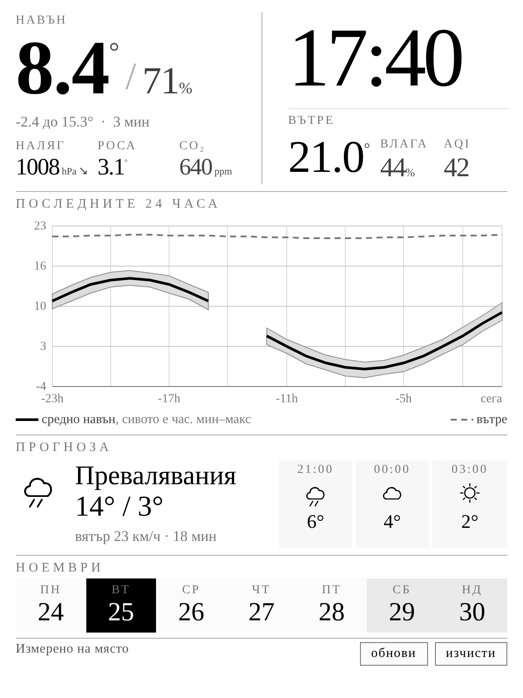

# Kindle dashboard (`GET /kindle`)

A weather panel for a 6" e-ink reader on the local network: outdoor and indoor
temperature from your own sensors, humidity and pressure, a 24-hour trend, and
a short forecast for the part a sensor cannot know.

Point the Kindle's experimental browser at `http://<collector-ip>/kindle`.



Rendered at 600×800 CSS px through a greyscale filter, which is how every
layout decision in this document was checked. The figures are synthetic; the
stylesheet is extracted from `KindleDashboard.cpp` at render time so the picture
cannot drift from the code.

## Enabling it

```ini
build_flags =
    ${env.build_flags}
    -DFEATURE_KINDLE_DASHBOARD
    -DKINDLE_OUTDOOR_SENSOR='"outdoor"'
    -DKINDLE_INDOOR_SENSOR='"indoor"'
    ; optional, adds the forecast section
    -DMODULE_FORECAST_ENABLED
    ; see "When the panel repaints" below
    -DKINDLE_REFRESH_SEC=300
    -DKINDLE_REFRESH_MIN_SEC=60
    -DKINDLE_DATA_PERIOD_SEC=60
    -DKINDLE_FOLLOW_DATA=1
```

The two sensor names are instance ids from `platform_config.json`. Typically
`outdoor` is a remote node (see [`node/`](../node/README.md)) and `indoor` is a
locally wired BME280.

## What is set where

The split is not arbitrary: anything that changes what the page *is* costs
flash whether you use it or not, so it is chosen at build time; anything that
changes what the page *says* is runtime.

| Setting | Where | Why |
|---|---|---|
| dashboard on/off | `setup.h` / `-DFEATURE_KINDLE_DASHBOARD` | the whole renderer is compiled out when off |
| `KINDLE_OUTDOOR_SENSOR`, `KINDLE_INDOOR_SENSOR` | build flag | also names the four `TrendRing` series registered at boot |
| `KINDLE_REFRESH_SEC`, `KINDLE_REFRESH_MIN_SEC`, `KINDLE_DATA_PERIOD_SEC`, `KINDLE_FOLLOW_DATA`, `KINDLE_CLOCK_PIN_REFRESH`, `KINDLE_CLOCK_SYNC_GUARD_SEC` | build flag | they only set numbers in a `<meta>` tag |
| `KINDLE_PAGE_W` | build flag | rescales every size in the stylesheet |
| `KINDLE_LANG_BG` | build flag | a single-language build pays nothing for the other |
| provider, key, lat/lon, outlook, interval | **the collector's web UI** | Settings → Modules → Weather forecast |

The forecast row is the part you will actually want to change after flashing —
coordinates, and whether the three columns step in hours or days — so it is a
module with a config schema like any other. Nothing about the forecast needs a
reflash.

The sensor ids are compile-time because `kindleTrackTrends()` registers them
with `TrendRing` once in `setup()`, before `ProcessingTask` starts, so that no
reading is missed. Making them editable at runtime means discarding 24 hours of
history on every save, which is a worse trade than editing one line and
reflashing on the rare occasion a sensor is renamed.

## The target

**Kindle Paperwhite 4** — 10th generation, 2018, model **PQ94WIF** — and any
other reader with the same 6" panel: 1072×1448 at 300 ppi.

> An earlier version of this document called PQ94WIF a 7th-generation 2015
> Paperwhite 3. That was wrong; it is the 10th generation. Nothing in the
> layout depended on it — both readers have the same panel — but the browser
> claim below did.

### It also suits a basic Kindle, by coincidence

**Kindle (7th generation, 2014)** — the entry-level model, 6" at **800×600 and
167 ppi**, 16 grey levels, infrared touch, Pearl e-paper, **no front light**.

Its panel *is* 600×800 at `devicePixelRatio` 1, so the default
`KINDLE_PAGE_W=600` maps one CSS pixel to one device pixel with no browser
scaling at all — the hairline softening the width knob exists to avoid does not
arise there.

And the two targets come out the same physical size. A Paperwhite spreads 600
CSS px across 1072 device px at 300 ppi, which is 0.151 mm per CSS px; the
Kindle 7 maps them 1:1 at 167 ppi, which is 0.152 mm. The page occupies the same
area of glass on both.

Two things are worse on it, though: Pearl e-paper ghosts more than Carta, so
`/kindle/clear` earns its keep; and with no front light a shelf dashboard needs
room light to be read at all.

Its firmware also predates 5.16.4, so the browser really is the old WebKit —
there the zero-JavaScript rule below is a requirement rather than a choice.

### Choosing the layout width

```ini
-DKINDLE_PAGE_W=600    ; default
```

Every size on the page is written as the figure it was tuned at for a 600 px
layout and passed through `kdPx()`, which rescales it to `KINDLE_PAGE_W` and
rounds. Proportions are identical at any width; only the pixel grid changes. At
600 `kdPx()` is the identity, so the default build is unchanged.

**Where 600×800 came from:** not a reported viewport. The page pins its own
layout width in the viewport meta, so the browser scales that width across the
panel's 1072 device px and the 1448 px of height follows the same ratio — at
600 that is about 1.79× and roughly **810 CSS px** of height, which is where the
800 px budget comes from.

**Why the width is a knob.** At 600 the browser scales the whole page by 1.79.
Type survives that — it is rasterised at the final size, not upscaled — but a
1 px rule becomes 1.79 device px and lands soft across two rows of pixels.
Laying out at the panel's own pixel count keeps hairlines on the grid.

Whether that helps depends on what the reader's browser reports for its
viewport and `devicePixelRatio`, which no amount of reasoning settles.

### `GET /kindle/probe`

Load it on the reader and read the numbers off:

- `innerWidth`, `innerHeight`, `devicePixelRatio` and `screen` — printed by the
  one piece of JavaScript in this whole feature, because those numbers are only
  knowable from inside the browser;
- the **user agent**, taken from the request header and printed server-side, so
  a firmware that runs no script still tells you which browser it is;
- a **ruler** of fixed-width bars needing no script at all: whichever bar
  reaches the right edge without overflowing names the value to build with.

| Value | Try it when |
|---|---|
| `600` | default; works on any firmware |
| `536` | the probe reports `devicePixelRatio` 2 |
| `1072` | the probe reports 1 |

Below 320 or above 2400 the build fails rather than rendering something that
was never measured. All three values above are checked at the device's viewport
before release: 796 of 810 at 600, 709 of 724 at 536, 1416 of 1448 at 1072, and
no horizontal overflow at any of them.

An earlier attempt at this got the chart wrong — the SVG kept its 600-px size
while everything around it scaled, which at 536 pushed the page 40 px wider than
the screen. That is the failure mode to watch for when adding anything with a
hard pixel size: it looks right at the default and only breaks off it.

### Why it is built for an old browser anyway

The Experimental Browser is WebKit, but *which* WebKit depends on firmware.
Older builds report a user agent in the 531–534 range — 2010–2011 vintage, with
no `fetch`, no `Promise`, no ES6, no flexbox, no CSS grid. Firmware **5.16.4**
modernised it on the 10th and 11th generation, so an up-to-date PQ94WIF would
in fact handle rather more than this page uses.

It is still built for the old one, because doing so costs nothing and the
alternative is a page whose correctness depends on the reader's firmware
version. So the page:

- is rendered server-side and ships **zero JavaScript**;
- lays out with tables and blocks, because those work on both;
- draws the trend chart as **inline SVG path data** — no canvas, no charting
  library, nothing to execute;
- refreshes with `<meta http-equiv="refresh">`, not a script.

None of that is a sacrifice on this medium. A panel that repaints in full or
not at all has no use for a script that updates part of itself.

## The top of the page

There is no masthead. The place name never changed and the date is carried by
the week strip at the foot, so the row was two lines of furniture standing above
the only two numbers the page exists to show. The hero row is the masthead.

The right half is split about two-to-one:

- **the clock**, at 96 px — an e-ink panel on a shelf is read from across a
  room, and the time used to be 14 px of grey in a corner;
- **inside temperature and humidity** below a hairline.

The inside 24-hour range went with the masthead. The dashed line on the chart
already carries it, and it was the least-read figure on the page.

### Temperature and humidity share a line

`8.4° / 71%`, on one baseline, humidity at half the size. They are one
measurement of one parcel of air at one instant, and a line break between them
was putting a paragraph boundary through a single reading. The same pairing
runs inside, at 40 px and 30 px.

The slash forces a width check: `-12.4° / 100%` is the widest this line can
get. A reading of four or more glyphs already drops to the smaller `.big4`
face, and `.big4 .hum-o` brings the pair down with it — without that rule the
humidity runs off the column in a hard frost. It is measured in the browser at
the device's viewport, not estimated.

### Pressure has its own size

34 px, on its own line, with the tendency underneath unchanged. The absolute
figure is the one number on the page a reader compares against memory rather
than against the page, and at 15 px it was set as a footnote to the humidity.

The two columns are different shapes, so their numerals are aligned by a fixed
box height on both (`.big`, `.clock`) plus a 12 px nudge on the clock, which has
no label above it to push it down. `.clock`'s height also sets where the divider
falls — two thirds down the cell the left column sizes. Getting this by eye is
what made an earlier version look ragged; it is measured in the browser instead.

### Language

```ini
-DKINDLE_LANG_BG    ; Bulgarian; omit for English
```

A compile-time switch, so a single-language build pays nothing for the other —
the unused literal is discarded. The weekday names in the week strip come from
tables in `DashboardStrings.h` rather than from `strftime`: the C locale would
give English names whatever the build language, and newlib on this part has no
`bg_BG` to switch to.

Cyrillic depends on the reader's fallback font. The page declares UTF-8 and
names the device's serif faces first, but Bookerly's Cyrillic coverage varies
by firmware — if a Bulgarian build shows boxes, that is the font, not the
encoding.

### The greys

The palette is `#000 #444 #777 #aaa #d8d8d8 #fff` plus two panel washes.

An earlier version of this page was pure black and white, on the reasoning
that "16-level e-ink dithers mid-greys into visible noise". That was
over-cautious and made the page poorer. The panel has **16 real grey levels**;
the dithering worth avoiding comes from gradients and from tones too close
together, not from flat, well-separated fills. Spaced this far apart, each
tone lands on its own level and renders solid.

The min/max band was originally hatched for the same wrong reason. With a flat
wash doing the job, the hatch was texture over texture — two bands that nearly
touch read as one muddy mass — so it is gone.

The two chart lines are still told apart by **dash pattern as well as** shade,
because redundant coding costs nothing and survives a panel with its contrast
turned down.

## When the panel repaints

Three ways, and one of them is not what it sounds like.

```ini
-DKINDLE_REFRESH_SEC=300       ; ceiling, and the fixed interval when following is off
-DKINDLE_REFRESH_MIN_SEC=60    ; floor: never repaint more often than this
-DKINDLE_DATA_PERIOD_SEC=60    ; how often readings are expected
-DKINDLE_FOLLOW_DATA=1         ; 0 for the old fixed interval
-DKINDLE_CLOCK_PIN_REFRESH=1   ; 0 lets the clock go stale between reloads
-DKINDLE_CLOCK_SYNC_GUARD_SEC=20 ; never reload sooner than this after rendering
```

### 1. The reader asks

A **refresh** button in the footer. A link, not a script, so a five-way pad
reaches it as readily as a fingertip.

It measures **72×26 CSS px**, which is about **11×4 mm** on any of the readers
this page targets — a 300 ppi Paperwhite scaling 600 CSS px across 1072 device
px and a 167 ppi Kindle 7 mapping them 1:1 both come to 0.15 mm per CSS px.

> An earlier version of this page claimed "128×46 device px, and 44 px is the
> smallest thing worth aiming at". That was wrong twice over: the 44 in the
> usual guidance is CSS px on a phone — roughly **9 mm** — and 4 mm is under
> half of it. The button is reachable with an infrared touch panel but it is not
> generous. The page has no spare height at 796 of 800 to grow it without taking
> the difference from the chart, which is a trade worth making deliberately
> rather than by accident.

> **Route order is load-bearing.** `AsyncCallbackWebHandler::canHandle` matches
> a URL that *starts with* its uri plus `/`, and the first registered handler
> that matches wins. `/kindle` registered before `/kindle/probe` and
> `/kindle/clear` swallowed both, and the sub-pages silently rendered the
> dashboard instead. The children are registered first.

### 2. The reader asks for a clean panel

E-ink keeps a ghost of what it drew before. A page of white and hairlines never
asks the controller for a full waveform, so a heavier layout can sit faintly
underneath for hours. **clear** walks `/kindle/clear` through four full-screen
frames, alternating black and white, and returns to the dashboard. That is what
actually resets the pixels; nothing an ordinary page draws will.

The step number comes in a query string, so it is reader-supplied and clamped —
otherwise a stray link could build a chain that never comes back.

### 3. The page reloads itself — a timer, not a push

**The collector cannot make the reader repaint.** A browser redraws when it
loads a page, and it loads one only when it asks. Server-sent events or a socket
would need JavaScript the older firmware does not have, and holding a request
open on AsyncTCP until data arrives risks the one thing a device on a shelf must
not do.

So `KINDLE_FOLLOW_DATA` **predicts** instead. The page knows when the newest
reading landed and how often readings are expected, and aims its own reload just
after the next one is due:

| Age of the newest reading | Reload in |
|---|---|
| less than one period | just after the next is due (+4 s), clamped to the floor |
| one to two periods | the floor — late, but one missed post is ordinary |
| over two periods | the ceiling — the source looks down, and flashing will not fix it |
| no reading, or clock behind it | the ceiling |

In practice the panel updates within a few seconds of new data without anything
being pushed to it.

### …and the clock, which is usually the louder demand

The clock is rendered server-side. It is correct at the moment it is painted
and stale from then on, so **a clock showing minutes is a standing demand for a
repaint every minute** whatever the data is doing.

`KINDLE_CLOCK_PIN_REFRESH=1` (default) aims the reload at the next **minute
boundary**, and that is not cosmetic. A page that reloads at :58 of each minute
displays the previous minute for 58 seconds out of every 60 — a clock that is
wrong most of the time. Landing on :00 makes the displayed minute change when
the minute changes.

It is deliberately **not** a plain `min()` of the two demands, and getting that
wrong produced two bugs at opposite ends of the same minute:

- at **:58** the boundary is 2 s away, the sync guard pushes the clock's request
  past it, and a data path floored at 60 undercut it by two seconds — locking
  the page permanently to the :58 offset;
- requiring the data to be five seconds earlier fixed that end and broke the
  other: from **:41 to :54** the guard pushes the clock to 79…66 s, the data's
  60 clears the margin, and the alignment is stolen again.

So the test is not *&#34;is the data earlier&#34;* but *&#34;does the data genuinely need a
faster cadence than one repaint a minute&#34;*. Anything asking for 60 s or more
wants what the clock wants, and the clock's version lands on the boundary.

`tests/host/test_refresh_cadence.cpp` checks this exhaustively — from every one
of the 60 seconds in a minute, the next reload lands on a boundary — and runs in
CI under all three sanitiser modes. The second bug above was found by that test,
not by reading the code.

`KINDLE_CLOCK_SYNC_GUARD_SEC` (20 s) is what stops a nearly-arrived boundary
turning into a second flash moments after the page loaded; below it, the
following boundary is taken instead. It is separate from
`KINDLE_REFRESH_MIN_SEC`, which floors the **data** path only — the clock cannot
honour a 60 s floor *and* align from a cold load, so the first reload after a
fresh load may come in 20–79 s before the cadence settles.

**An unsynced device does not pin.** The page prints &#34;clock not set&#34; rather than
a time, so there is no clock to keep honest; pinning there would defeat the
backoff entirely and repaint every minute forever waiting on a node that is not
coming back.

**At the default settings the clock always wins.** The data floor is 60 s and
the clock never asks for more than 60, so `KINDLE_FOLLOW_DATA` changes nothing
unless pinning is off, or `KINDLE_REFRESH_MIN_SEC` drops below a minute with a
node posting faster than that. Said out loud because it would otherwise look
like the data logic is doing work it is not.

### The cost, plainly

Every reload repaints the whole panel: it flashes, and it draws battery. With
the clock pinned that is **about 1440 page loads a day** — a reader on a
charger, not one running a fortnight on its battery.

`KINDLE_CLOCK_PIN_REFRESH=0` lets the clock go stale by up to
`KINDLE_REFRESH_SEC` between reloads. For a 96 px clock read across a room that
is a confident lie, so prefer lowering `KINDLE_REFRESH_SEC` to something the
clock can live with over turning the pinning off.

## The 24-hour trend needs its own storage

This is the part worth understanding before you wonder why a new feature
appeared alongside the page.

`webRingBuf` holds a **fixed byte budget** of raw readings — about 227 entries
on a C3. A build emitting ~19 metrics every 10 s fills that in roughly **two
minutes**. Even the 4 MB PSRAM ring on an S3 reaches about eight hours, and
the FS-backed history that would cover the rest is still stubbed out.

So a 24-hour trend cannot be a query over existing storage. `TrendRing` keeps
a fixed grid of hourly aggregates instead:

```
4 series × 24 hours × 12 bytes ≈ 1.2 KB of RAM, constant
```

That is affordable on every target including the C3, which is what makes the
headline feature work on the board you probably have rather than only on the
one with PSRAM.

It stores **min / max / mean per hour**, not raw samples. A 6" panel cannot
resolve more than a couple of hundred horizontal pixels of line anyway, and
min/max is what makes an overnight frost visible — a mean-only trend hides
exactly the excursion you want to see.

Hours with no reading **break the line** rather than interpolating across the
gap. A flat line through a four-hour outage reads as "it was steady", which is
a lie the chart should not tell.

Vertical rules every three hours give the eye something to count against. The
hour labels are six-hourly — closer together they crowd — so between two of
them there was nothing to carry a point on the curve down to. They are drawn
first, so the band and the lines cover them, and lighter than the horizontals
because they are scaffolding rather than data. `#d5d5d5` rather than something
fainter: the panel quantises to 16 levels and a near-white rule rounds away to
nothing.

The grid fills as readings arrive: expect a partial chart for the first day
after a reboot, and the section says so rather than drawing an empty box.

## Forecast

Weather&Radar (WetterOnline) has **no publicly documented free API** — it is a
B2B product behind a commercial agreement. Two providers that do publish one
are implemented:

| Provider | `provider` | Key | Notes |
|---|---|---|---|
| Open-Meteo | `open-meteo` | none | No account, no quota worth counting. The default. |
| OpenWeatherMap | `owm` | required | Free tier ~1000 calls/day. |

Configure via the module UI or `modules.json`:

```json
{
  "forecast": {
    "enabled": true,
    "provider": "open-meteo",
    "outlook": "hourly",
    "lat": 42.6977,
    "lon": 23.3219,
    "interval_min": 30
  }
}
```

### The three outlook columns

`outlook` chooses what the right-hand side of the forecast row steps through:

| Value | Columns | Shows |
|---|---|---|
| `hourly` (default) | +3 h, +6 h, +9 h | temperature at that hour |
| `daily` | tomorrow, +2, +3 days | that day's high / low |

An hour has no range to report, so hourly columns print one figure — printing
`11° / 11°` would imply a precision the slot does not have.

**Open-Meteo** serves both from one request. `forecast_hours` anchors the
hourly array on the current hour rather than local midnight, which is what
makes indices 3/6/9 mean +3/+6/+9 h without any date arithmetic on the device.

**OpenWeatherMap's free tier does not have a daily endpoint**, and splits what
Open-Meteo returns in one response across two: `/weather` for current
conditions, `/forecast` for the 3-hourly list. So the OWM path makes two
requests back to back — together about 12 s worst case against ExportTask's 30 s
watchdog, which is why the per-request timeout is 6 s and redirect following is
off.

In `daily` mode the OWM days are **aggregated from that same 3-hourly list**:
high and low per local day, with the condition taken from the slot nearest
midday. Nearest-midday rather than first-of-day on purpose — an early-hours
shower should not make an otherwise sunny day render as rain. `cnt=24` bounds
how much JSON lands in heap.

If the outlook request fails the current conditions are still shown: three
empty columns are a smaller loss than a blank forecast block.

`interval_min` is clamped to 10–360. A forecast does not change faster than
that, and the floor is what keeps a misconfigured device off a provider's
rate limit.

### The temperature on the dashboard is yours, not the forecast's

Deliberately. The headline figures are what your BME280s measured; the
forecast contributes only the sky. A forecast's "current temperature" is an
interpolation from a station that may be 20 km away, and putting it beside a
real reading invites trusting the wrong one.

### A stale forecast is kept, not blanked

A failed fetch does not invalidate the cache. A three-hour-old forecast is
still broadly right, and blanking the panel because one HTTPS request timed
out trades useful for nothing. The age is printed, so you can judge.

### On OpenWeatherMap's high/low

On the free current-weather endpoint, `temp_min`/`temp_max` are the spread
across nearby stations **at this moment**, not today's high and low. They are
shown as-is rather than relabelled — inventing a daily range the API did not
supply would be worse than a narrow one. Open-Meteo's daily fields are the
real thing, which is one more reason it is the default.

## Week strip

The foot of the page carries the current week with today inverted, under a
month heading set like the two section headings above it. It answers the
question a static panel on a shelf is otherwise bad at: what day is it.

The day numbers alone say which day but not which month, which is what the
masthead used to answer. A week can straddle two months, and then one name is
wrong about half the row, so both are named — `НОЕМВРИ – ДЕКЕМВРИ`. They are
read off Monday and Sunday rather than off today, because today may be either
side of the boundary.

Monday-first. `tm_wday` counts from Sunday, so the column index is
`(wday + 6) % 7`; getting that backwards misplaces today on Sundays only,
which is the sort of bug that survives a casual look. The days either side are
walked on the epoch rather than on `tm_mday`, so month and year ends are
correct for free.

Today is marked by inverting the cell rather than outlining it: a filled block
is the one mark that stays unambiguous after e-ink dithering, where a thin
ring can read as a smudge.

## TLS

The forecast client uses `setInsecure()`, consistent with `HttpExporter` and
for the same reason: no CA bundle is shipped yet. On a LAN device fetching a
public forecast this is an accepted risk — the payload is not secret, and the
worst a MITM achieves is a wrong temperature on a bookshelf. It would not be
acceptable for anything carrying credentials, which is why the ingest path
never reaches outward.
